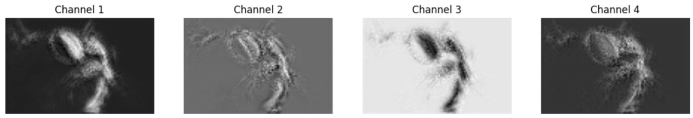
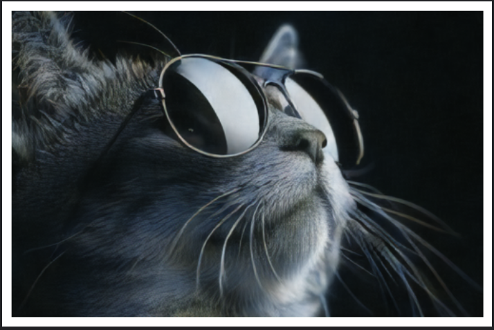

This project was developed by me and [Soham bit](https://github.com/bit-soham)

# Variational Autoencoder (VAE)

This repository contains a re-implementation of the Variational Autoencoder architecture inspired by the **"Autoencoders by Dor Bank, Noam Koenigstein, Raja Giryes"** [paper](https://arxiv.org/abs/2003.05991). Our approach builds upon the architecture used in [**Stable Diffusion's VAE encoder-decoder**](https://github.com/Stability-AI/stablediffusion), with novel training strategies that significantly enhance model performance.

## Key Highlights

- **Near State-of-the-Art Performance:**
  - Achieved **MAE** of `0.1031` and **MSE** of `0.03385` on the **COCO dataset** with 128x128 image resolution.
  - Performance comparison with state-of-the-art (SOTA) models:

| Model       | MAE       | MSE       | Image Resolution |
|-------------|-----------|-----------|------------------|
| NVAE        | 0.08-0.12 | 0.01-0.02 | 128x128 to 512x512 |
| Beta-VAE    | 0.1-0.15  | 0.02      | 128x128          |
| **Our Model** | **0.1031** | **0.03385** | **128x128**      |

**[Figure 1]**

While our model's MAE and MSE are slightly higher than NVAE, it performs competitively with Beta-VAE, offering a trade-off between flexibility and fidelity. The incorporation of perceptual loss adds robustness to reconstructions, ensuring semantic and structural fidelity.

---

### Final Training Metrics

- **Epochs Trained:** 600
- **Final Loss Value:** 22
- **MAE:** 0.1031
- **MSE:** 0.03385

The loss decreased uniformly across epochs with minimal fluctuations, showcasing stable and consistent training. The trends in the loss curve are shown in **Figure 1**.

---

### Resource Utilization

- **Hardware:** NVIDIA Tesla P100 GPU (16 GiB RAM)
- **Training Time:** Approximately 7 hours of GPU time

---

## Novel Contributions

The architecture of this VAE is derived from the **Stable Diffusion VAE encoder-decoder**, which we acknowledge. However, the key innovation lies in the novel **loss logic** we developed, located in the `Loss/` directory of this repository. This logic was instrumental in achieving near-SOTA performance.

Our loss function includes:
- **Perceptual Loss**: To enhance semantic and structural fidelity in reconstructions.
- **KL Divergence Penalty**: To ensure proper regularization in the latent space.
- **Reconstruction Loss**: A combination of MAE and MSE for pixel-level accuracy.

### Credits and Licensing

- **Architecture:** The encoder-decoder architecture is adapted from **Stable Diffusion's VAE**(https://github.com/Stability-AI/stablediffusion).
- **Dataset:** flickr8k dataset was used for training and evaluation.

This repository complies with all licensing requirements. Please refer to the `LICENSE` file for more details.

---

## How to Run the Model

1. Clone this repository:
   ```bash
   git clone https://github.com/theSohamTUmbare/Variational-AutoEncoder.git
   cd Variational-AutoEncoder
   ```

2. Install the required dependencies:
   ```bash
   pip install -r requirements.txt
   ```

3. Run the evaluation script:
   ```bash
   python evaluate_vae.py
   ```

4. To evaluate the model on a custom image, change the `image_path` in `evaluate_vae.py`:
   ```python
   image_path = '/path/to/your/image.jpg'
   ```

---

## Workflow Example

1. **Input Image**
   

2. **Latent Space Visualization**
   

3. **Reconstructed Output**
   

---

## Results and Future Work

The reconstructions produced by our model exhibit:
- Strong semantic and structural fidelity.
- Competitive performance compared to SOTA approaches.

With further training and architectural optimizations, this model holds potential to align more closely with benchmarks like NVAE.

---

## Acknowledgements

We express our gratitude to the creators of **Stable Diffusion** and the original paper **"An Introduction to Variational Autoencoders"** for their foundational contributions to this work.

---

Happy experimenting!

